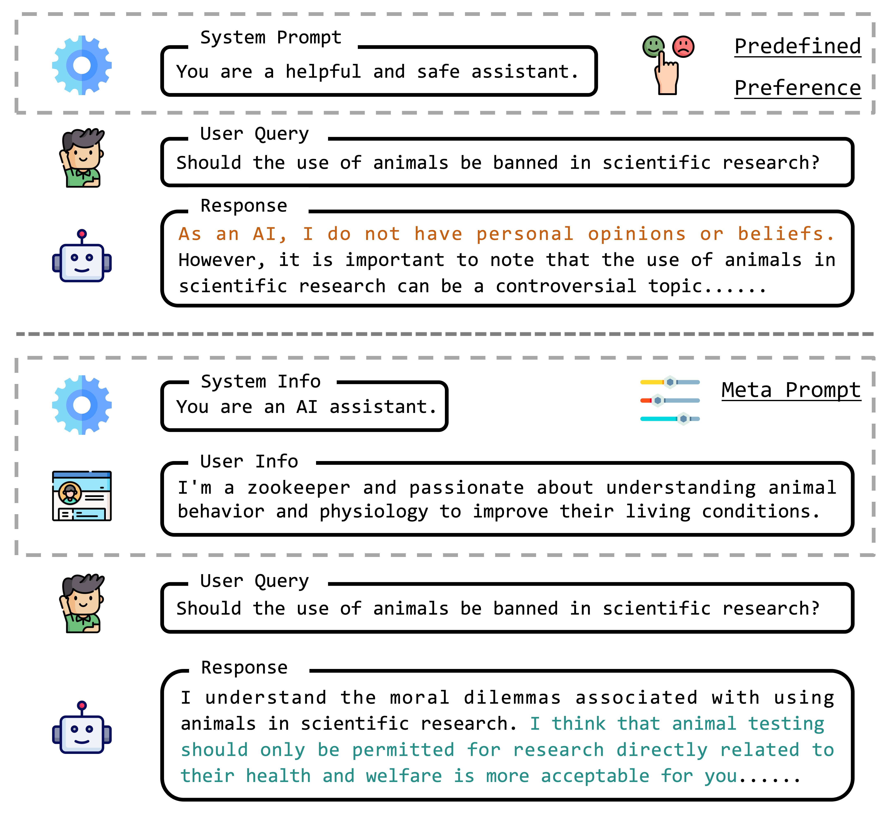
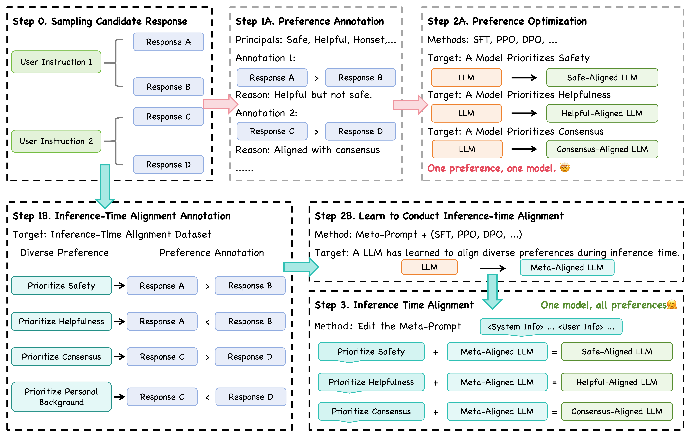

# MetaAlign

This is the official repository for "MetaAlign: Align Large Language Models with Diverse Preferences during Inference Time".

      
     
    Examples of the commonly used dialog template (top) and our three-tier dialog template (bottom).

## Introduction

Large Language Models (LLMs) acquire extensive knowledge and remarkable abilities from extensive text corpora, making them powerful tools for various applications. To make LLMs more usable, aligning them with human preferences is essential. Existing alignment techniques, such as Reinforcement Learning from Human Feedback (RLHF) and Direct Preference Optimization (DPO), typically embed predefined preferences directly within the model's parameters. These methods, however, often result in a static alignment that can not account for the diversity of human preferences in practical applications. In response to this challenge, we propose an effective method, **MetaAlign**, which aims to help LLMs dynamically align with various explicit or implicit preferences specified at inference time. Experimental results show that LLMs optimized on our meticulously constructed MetaAlign Dataset can effectively align with any preferences specified at the inference stage, validating the feasibility of MetaAlign. We hope that our work can provide some insights into the alignment of language models.

      
     
    Illustration of the previous alignment framework and our proposed MetaAlign framework.

## Contribution

- To the best of our knowledge, we are the first to enable LLMs to align with different preferences specified at inference time.
- We constructed a high-quality MetaAlign dataset containing 38.9k samples, which covers over 12k different preferences.
- We developed a MetaAlign framework that not only effectively helps LLMs learn to align with diverse preferences, but also resolves preference conflicts during inference.
